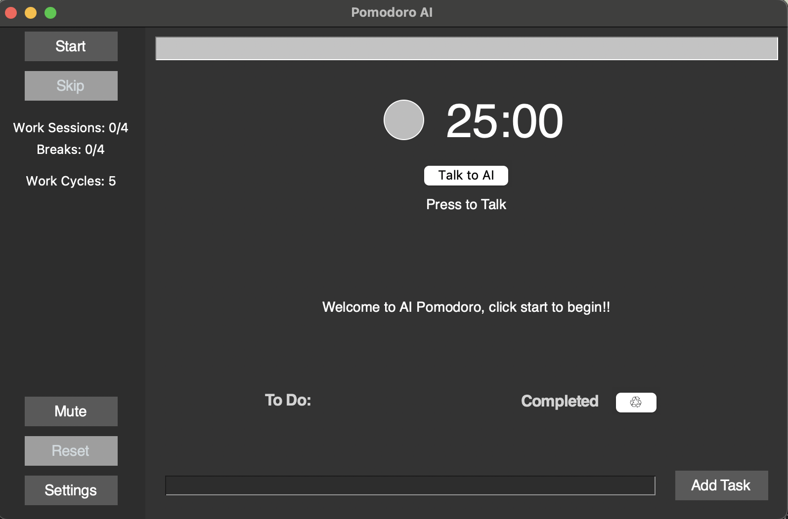
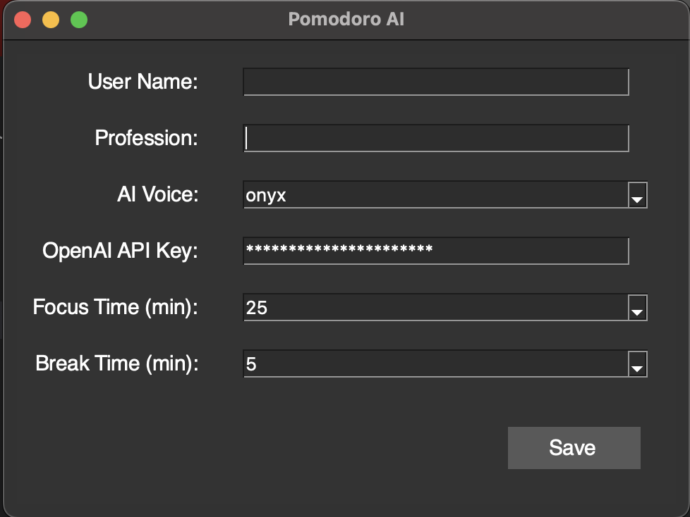

# Pomodoro AI 



Enhance your productivity with this straightforward desktop application, the Pomodoro Timer with AI integration and voice assistant. Developed using Python and Tkinter, it not only assists in managing your work and break intervals efficiently but also keeps you motivated with uplifting quotes. Start by talking to the AI about your tasks to help you better plan your work sessions and then click "Start" to start your work session.

## Key Features

- "Talk to AI" to discuss what to work on and help you plan your work sessions
- Tailor work and break periods to your preference
- Inspirational quotes displayed, courtesy of OpenAI
- User-friendly graphical interface
- Audible alerts signaling the start and end of sessions

## Prerequisites

- macOS operating system - tested on 14.4.1
- Python version 3.11 or above
- Tkinter library (usually comes with Python installations on macOS)
- OpenAI Python package
- Valid OpenAI API key
- Stable internet connection

## Setting Up

### Step 1: Install Python

Ensure Python 3.11 or above is installed on your device. You can download it from [python.org](https://www.python.org/downloads/).

### Step 2: Clone the Repository

Clone the repository to your local machine using the following command in your terminal:

```bash
git clone https://github.com/alexpwrd/pomodoro-ai.git
cd pomodoro-ai
```

### Step 3: Set Up the Python Environment

You can use Python's built-in `venv` module to create a virtual environment:

```bash
python -m venv venv
source venv/bin/activate # On Windows use venv\Scripts\activate
```

### Step 4: Install Required Packages

Install the necessary Python packages using pip:

```bash
pip install -r requirements.txt
```

### Step 5: Obtain an OpenAI API Key

To use the motivational quote feature, you need a valid OpenAI API key. Obtain one by signing up or logging into your account at [OpenAI](https://www.openai.com/), and navigating to the API section.

### Step 6: Input Your OpenAI API Key

Input your OpenAI API key directly into the application settings. This can typically be done through the application's settings menu or configuration file, depending on how `settings.py` is structured in the project.

## Application Settings Interface

Here is a preview of the application settings interface where you can input your OpenAI API key and customize other settings:



## How to Use

### How to Use the Voice Assistant

1. **Activate the Voice Assistant**: Click the "Talk to AI" button located in the main interface of the application. This will activate the voice assistant and it will start listening to your commands.

2. **Speak Your Command**: After clicking the "Talk to AI" button, speak clearly into your microphone. The voice assistant is designed to understand natural language and can handle a variety of commands related to productivity, task management, and motivational support.

3. **Receive Feedback and Guidance**: Once your command is processed, the voice assistant will provide feedback directly through the application's interface. 

### Starting the Pomodoro Timer

1. **Navigate to the Project Directory**: Ensure you are in the project directory where the application is located.

2. **Activate the Virtual Environment**: Make sure your virtual environment is activated. If not, you can activate it using the appropriate command for your operating system.

3. **Run the Application**: Execute the following command in your terminal:
   ```bash
   python pomodoro.py
   ```

This will launch the Pomodoro Timer application. Through its graphical interface, you can:

- **Set Focus and Break Durations**: Use the dropdown menu to select your desired focus and break durations.
- **Control the Timer**: Start, pause, or reset the timer using the corresponding buttons.
- **Get Motivated**: During breaks, the application will fetch and display an inspirational quote from OpenAI. An audible alert will also signal the start and end of each session.

Enjoy enhanced productivity and motivation with your AI Pomodoro Timer!
